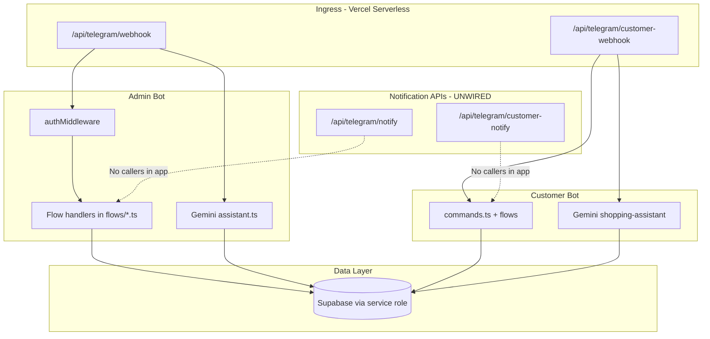
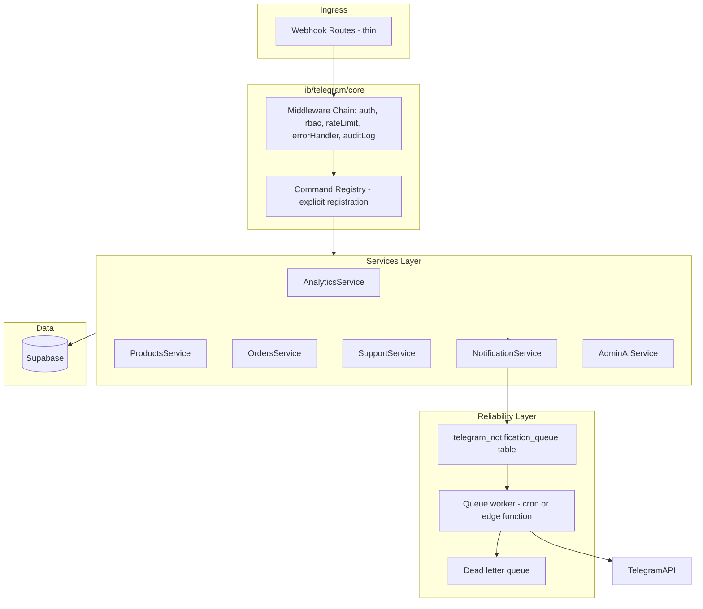

# KelalShop Telegram Bot — Enterprise Audit & Refactor Plan

## Executive Summary

The Telegram integration consists of **two separate bots** (Admin + Customer) with webhook entry points on Vercel. The bots are **not production-ready**: most admin notifications are **never triggered**, several commands are **missing or stubbed**, customer flows have **critical schema mismatches**, and **website admin role does not grant Telegram access**. Your "Access Denied" issue is expected until your Telegram chat ID is registered in `telegram_admins` with `is_approved = true`.

**Current state:** ~40% functional (basic command shells exist; data layer and event wiring are broken).

**Target state:** 24/7 webhook-only bots, sub-2s commands, queued notifications, RBAC, searchable logs, real Supabase analytics, zero schema drift.

---

## 1. Architecture Audit

### Current Architecture



### Critical Architecture Issues

| Issue | Location | Why It Matters |
|-------|----------|----------------|
| **Side-effect imports for handler registration** | [`lib/telegram/admin/commands.ts`](lib/telegram/admin/commands.ts), flow files | Fragile ES module hoisting; middleware order bugs already documented in [`bot.ts`](lib/telegram/admin/bot.ts) |
| **Shared Supabase client in middleware** | [`lib/telegram/admin/middleware.ts`](lib/telegram/admin/middleware.ts) | Customer bot imports admin middleware for DB access — tight coupling |
| **Dual runtime modes** | [`run-bot.ts`](run-bot.ts), [`run-customer-bot.ts`](run-customer-bot.ts) vs webhooks | Long-polling + webhook together causes duplicate/conflicting updates in production |
| **No service layer** | All flows query Supabase directly | Duplicated queries, inconsistent filters, untestable |
| **No notification bus** | [`app/api/telegram/notify/route.ts`](app/api/telegram/notify/route.ts) | Events defined but **zero callers** in `lib/actions/*` — notifications never fire |
| **In-memory broadcast state** | [`lib/telegram/admin/flows/broadcast.ts`](lib/telegram/admin/flows/broadcast.ts) | Lost on every Vercel cold start; not 24/7 safe |
| **No error boundary middleware** | Webhook routes | Unhandled exception → 500 → Telegram retries storm |
| **Website admin ≠ Telegram admin** | [`middleware.ts`](lib/telegram/admin/middleware.ts) | Checks `telegram_admins` + `ADMIN_CHAT_ID` only; `profiles.role = 'admin'` is ignored |

### Proposed Architecture (Target)



### Folder Structure (Target)

```
lib/telegram/
├── core/
│   ├── admin-bot.ts              # Bot instance factory
│   ├── customer-bot.ts
│   ├── supabase-admin.ts         # Single service-role client
│   ├── logger.ts                 # Structured logging
│   ├── rate-limit.ts             # Per-chat + per-command limits
│   ├── rbac.ts                   # Role + permission matrix
│   ├── error-handler.ts          # Global grammy error middleware
│   ├── telegram-format.ts        # Consistent MarkdownV2/HTML helpers
│   └── types.ts
├── admin/
│   ├── register-handlers.ts      # Explicit handler registration (no side effects)
│   ├── middleware/auth.ts
│   └── commands/
│       ├── start.ts, help.ts, dashboard.ts, orders.ts, products.ts,
│       ├── sellers.ts, users.ts, tickets.ts, revenue.ts, analytics.ts,
│       ├── withdrawals.ts, staff.ts, security.ts, search.ts, broadcast.ts
│   └── services/
│       ├── analytics.service.ts
│       ├── products.service.ts
│       └── staff.service.ts
├── customer/
│   ├── register-handlers.ts
│   ├── middleware/link-auth.ts   # Populate ctx.linkedUser once
│   └── commands/ + flows/        # Refactored, schema-aligned
├── notifications/
│   ├── templates.ts              # ETB currency, HTML parse mode
│   ├── admin-dispatcher.ts       # broadcastToAdmins with retry
│   ├── customer-dispatcher.ts
│   ├── event-emitter.ts            # Called from lib/actions/*
│   └── queue-processor.ts
└── ai/
    ├── admin-assistant.ts          # Structured context, verified responses
    └── customer-assistant.ts
```

**Remove or deprecate after migration:**
- Side-effect flow imports pattern in current [`flows/*.ts`](lib/telegram/admin/flows/)
- [`run-bot.ts`](run-bot.ts) / [`run-customer-bot.ts`](run-customer-bot.ts) — dev-only, documented clearly
- [`scratch_test_bot.ts`](scratch_test_bot.ts) if present

---

## 2. Functional Audit — Admin Notifications

### Notification Pipeline Today

| Event | Template Exists | API Route Case | Trigger in App Code | Telegram Delivery | Verdict |
|-------|----------------|----------------|---------------------|-------------------|---------|
| New Order | Yes | `NEW_ORDER` | **None** | Never | **BROKEN** |
| New Seller | Yes | `NEW_SELLER` | **None** | Never | **BROKEN** |
| Product Pending | Yes | `PRODUCT_PENDING` | **None** | Never | **BROKEN** |
| Product Approved | Yes | `PRODUCT_APPROVED` | **None** | Never | **BROKEN** |
| Product Rejected | Yes | `PRODUCT_REJECTED` | **None** | Never | **BROKEN** |
| Withdrawal Request | Yes | `WITHDRAWAL_REQUEST` | **None** | Never | **BROKEN** |
| Support Ticket | Yes | `SUPPORT_TICKET` | **None** | Never | **BROKEN** |
| Suspicious Login | Yes | `SUSPICIOUS_ACTIVITY` | **None** | Never | **BROKEN** |

**Root cause:** [`broadcastToAdmins`](lib/telegram/notifications.ts) is only invoked from [`app/api/telegram/notify/route.ts`](app/api/telegram/notify/route.ts), which has **no callers** anywhere in `lib/actions/*` or `app/*`.

### Additional Notification Bugs

- **Wrong currency:** Templates use `$` ([`notifications.ts`](lib/telegram/notifications.ts) lines 34, 49) — app uses **ETB**
- **No retry logic:** Failed `sendMessage` is logged and dropped
- **No dead letter queue:** Lost notifications are unrecoverable
- **No idempotency:** Retries could duplicate messages
- **Customer notify unwired:** [`customer-notify/route.ts`](app/api/telegram/customer-notify/route.ts) also has zero callers; order lifecycle in [`lib/actions/orders.ts`](lib/actions/orders.ts) does not notify buyers
- **Semantic mismatch:** `/withdrawals` command shows `payment_requests` (seller **payments to platform**), not seller payout withdrawals

### Required Wiring (Post-Refactor)

| Trigger Point | Event |
|---------------|-------|
| [`lib/actions/orders.ts`](lib/actions/orders.ts) — order creation | `NEW_ORDER` + customer `ORDER_*` |
| [`lib/actions/admin.ts`](lib/actions/admin.ts) — seller approve/reject | `NEW_SELLER` |
| [`lib/actions/products.ts`](lib/actions/products.ts) — new product submit | `PRODUCT_PENDING` |
| [`lib/actions/admin.ts`](lib/actions/admin.ts) — product approve/reject | `PRODUCT_APPROVED` / `REJECTED` |
| [`lib/actions/payments.ts`](lib/actions/payments.ts) — payment request | `WITHDRAWAL_REQUEST` (rename to `PAYMENT_REQUEST`) |
| Customer support flow — ticket created | `SUPPORT_TICKET` |
| [`lib/actions/admin-auth.ts`](lib/actions/admin-auth.ts) + `login_attempts` table | `SUSPICIOUS_ACTIVITY` |

All triggers should enqueue to `telegram_notification_queue` first, then process asynchronously.

---

## 3. Command Audit — Admin Bot

### Command Status Matrix

| Command | Exists | Returns Real Data | Permissions | Issues |
|---------|--------|-------------------|-------------|--------|
| `/start` | Yes | N/A | Public | Good UX for non-admins; no onboarding path to request access |
| `/help` | Yes | N/A | Staff+ | Lists commands that don't exist (`/search`, `/tickets`) |
| `/dashboard` | Yes | Partial | Staff+ | Hardcoded Security Alerts `0`; uses `is_available=false` for pending count instead of `approval_status` |
| `/orders` | Yes | Partial | Staff+ | Only today's count; no status breakdown |
| `/products` | Yes | Yes (count only) | Staff+ | No list; total count only |
| `/pending` | Yes | **Wrong filter** | Staff+ | Filters `is_available=false` not `approval_status='pending'`; join uses `store_name` but schema has `business_name` |
| `/sellers` | Yes | Yes | Staff+ | OK |
| `/revenue` | Yes | Partial | Admin only | Uses invalid status `paid` (schema: `pending, accepted, shipped, delivered, cancelled, disputed`) |
| `/users` | **NO** | — | — | **Missing entirely** (requested but not implemented) |
| `/tickets` | **NO** | — | — | **Missing** (help advertises it; dashboard button says "Run /tickets") |
| `/analytics` | Yes | **Stub** | Admin only | Returns placeholder text only |
| `/withdrawals` | Yes | Partial | Admin only | Wrong domain (payment_requests not payouts); wrong join column `store_name` |
| `/search` | **NO** | — | — | **Missing** — silent no-response (text handler skips `/` commands) |
| `/staff` | Yes | Yes | Admin only | Read-only list; no add/remove |
| `/security` | Yes | **Stub** | Admin only | Always "No alerts"; `login_attempts` table exists but unused |
| `/broadcast` | Yes | **Fake** | Admin only | In-memory state; claims sent without sending |
| AI text | Yes | Partial | Staff+ | Gemini context uses wrong fields/statuses; can hallucinate beyond limited context |

### Your Access Denied Issue — Root Cause

Auth in [`middleware.ts`](lib/telegram/admin/middleware.ts):

1. Match `ADMIN_CHAT_ID` env var **OR**
2. Row in `telegram_admins` where `telegram_chat_id = your chat ID` AND `is_approved = true`

**Being admin on kelalshop.com does not help.** Fix: run [`scripts/make-admin.ts`](scripts/make-admin.ts) with your Telegram chat ID in `ADMIN_CHAT_ID`, or insert your chat ID into `telegram_admins` in Supabase.

---

## 4. Command Audit — Customer Bot

| Command | Status | Critical Bugs |
|---------|--------|---------------|
| `/start`, `/help` | OK | — |
| `/link` | **Broken** | Queries `profiles.email` (column doesn't exist in schema); OTP only logged to console |
| `/support` | **Broken** | Inserts wrong columns (`shopper_id`, `title`, `status: open`, `message` vs `content`) |
| `/orders` | **Broken** | Uses `shopper_id` instead of `buyer_id` — buyers see empty/wrong orders |
| `/track` | **Broken** | Filters `processing` status (doesn't exist); cancel callback has no ownership check |
| `/deals` | **Broken** | Selects `discount_percent` (schema: `discount_percentage`); wrong URL `/deals` |
| `/search` | Partial | Works for search but FAQ heuristic too broad; missing `approval_status` filter |

---

## 5. Security Audit

### Current State

| Area | Status | Risk |
|------|--------|------|
| Bot token storage | Env vars only | OK if Vercel secrets configured |
| Webhook validation | `x-telegram-bot-api-secret-token` check | OK pattern in both webhook routes |
| Admin auth | Chat ID whitelist + DB | **No link to web admin accounts**; no audit trail for bot actions |
| Staff RBAC | `admin` vs `staff` via `requireAdmin` | Partial; inconsistent (some commands use inline `isAdmin` only) |
| Internal API | `Bearer INTERNAL_API_KEY` | OK but key rotation/monitoring not documented |
| Service role in bot | Full Supabase access | Required but **no query scoping** — AI could expose any table data if prompt expanded |
| Gemini API | Direct calls, no rate limit | Cost/abuse risk; no per-admin quota |
| Rate limiting | `rate_limits` table exists in DB | **Not used by Telegram bots** |
| Cancel order callback | No buyer verification | **Critical** — anyone with order UUID can cancel |
| OTP | Plaintext in DB, console-only delivery | **Broken in production** |

### Required Security Layer

- **RBAC matrix:** Define permissions per role (`admin`, `staff`) per command + callback
- **Chat ID whitelist bootstrap:** `/linkadmin` flow for super-admin to approve new telegram admins (optional Phase 2)
- **Rate limiting:** 30 commands/min per chat; 5 OTP attempts/hour
- **Audit logs:** New `telegram_audit_logs` table — command, chat_id, role, payload hash, result, duration_ms
- **Request validation:** Zod schemas for all webhook-adjacent internal API payloads
- **Callback ownership checks:** All inline actions verify entity belongs to requesting user/admin
- **Gemini guardrails:** Whitelist query types; never pass raw table dumps; response validation against fetched numbers

---

## 6. Database Audit

### Schema Mismatches (Must Fix Before Any Feature Work)

| Bot Code | Actual Schema | File |
|----------|---------------|------|
| `profiles.email` | Email in `auth.users` only | [`auth.flow.ts`](lib/telegram/customer/flows/auth.flow.ts) |
| `orders.shopper_id` for buyer orders | Use `buyer_id` | [`orders.flow.ts`](lib/telegram/customer/flows/orders.flow.ts) |
| `status: 'processing'` | Enum has `accepted` | [`orders.flow.ts`](lib/telegram/customer/flows/orders.flow.ts) |
| `status: 'paid'` for revenue | No such status | [`revenue.ts`](lib/telegram/admin/flows/revenue.ts), [`assistant.ts`](lib/gemini/assistant.ts) |
| `is_available=false` for pending | Use `approval_status='pending'` | [`products.ts`](lib/telegram/admin/flows/products.ts), dashboard |
| `shopper_profiles.store_name` | Column is `business_name` | products, withdrawals flows |
| `support_sessions.shopper_id/title/open` | `user_id`, no title, status `bot/human/closed` | [`support.flow.ts`](lib/telegram/customer/flows/support.flow.ts) |
| `support_messages.message/sender_id/shopper` | `content`, `sender_type: user/bot/admin` | [`support.flow.ts`](lib/telegram/customer/flows/support.flow.ts) |
| `promotions.discount_percent` | `discount_percentage` | [`deals.flow.ts`](lib/telegram/customer/flows/deals.flow.ts) |

### Missing Indexes (Add in Migration)

```sql
CREATE INDEX IF NOT EXISTS idx_telegram_admins_chat_id ON telegram_admins(telegram_chat_id) WHERE is_approved = true;
CREATE INDEX IF NOT EXISTS idx_telegram_users_chat_id ON telegram_users(chat_id);
CREATE INDEX IF NOT EXISTS idx_telegram_users_profile ON telegram_users(profile_id) WHERE is_verified = true;
CREATE INDEX IF NOT EXISTS idx_orders_created_at ON orders(created_at DESC);
CREATE INDEX IF NOT EXISTS idx_orders_buyer_id ON orders(buyer_id, created_at DESC);
CREATE INDEX IF NOT EXISTS idx_products_approval_status ON products(approval_status) WHERE approval_status = 'pending';
CREATE INDEX IF NOT EXISTS idx_notification_queue_status ON telegram_notification_queue(status, scheduled_at);
```

### N+1 Patterns

- [`withdrawals.ts`](lib/telegram/admin/flows/withdrawals.ts) — loops `sendMessage` per request (OK for 5 items)
- [`customer-notify`](app/api/telegram/customer-notify/route.ts) — sequential broadcast to all users (needs batching + rate limit for Telegram 30 msg/sec cap)

---

## 7. Reliability Improvements

### Why Bot Is Not 24/7 Safe Today

- Vercel serverless cold starts reset in-memory state ([`broadcast.ts`](lib/telegram/admin/flows/broadcast.ts))
- No health check endpoint for Telegram webhook monitoring
- Failed Supabase/Telegram calls crash handler with no graceful reply
- Long-polling scripts conflict with production webhooks

### Target Reliability Stack

| Component | Implementation |
|-----------|----------------|
| **Notification queue** | New table `telegram_notification_queue` (id, type, payload, status, attempts, scheduled_at, last_error) |
| **Retry policy** | 3 retries with exponential backoff (1m, 5m, 15m) |
| **Dead letter queue** | Move to `telegram_notification_dlq` after max attempts |
| **Circuit breaker** | If Telegram API fails 5x in 1 min, pause queue processing 2 min |
| **Health check** | `GET /api/telegram/health` — checks webhook registered, DB reachable, queue depth |
| **Graceful errors** | Grammy error middleware: always reply user-friendly message, never silent fail |
| **Webhook-only prod** | Remove polling from production; `npm run bot` = dev only |

### New Migration File

`supabase/migration_telegram_enterprise.sql` — queue tables, audit logs, indexes, optional `profiles` view for safe email lookup.

---

## 8. Logging System

### Current: `console.error` only — not searchable

### Target: Structured JSON logs + DB audit table

**Log every:**
- Incoming update (type, chat_id, command, duration_ms)
- Admin action (approve product, broadcast, etc.)
- Notification enqueue/delivery/failure
- Security violation (unauthorized command, rate limit hit)
- API errors (Supabase code, Telegram error description)

**Implementation:**
- [`lib/telegram/core/logger.ts`](lib/telegram/core/logger.ts) — wrapper with correlation ID per update
- [`telegram_audit_logs`](supabase) table for persistent searchable history
- Vercel log drain compatible format: `{ level, service: 'telegram-admin', event, chatId, ... }`

---

## 9. Analytics Improvements

Replace stub [`analytics.ts`](lib/telegram/admin/flows/analytics.ts) with real `AnalyticsService` querying:

| Metric | Query Source |
|--------|--------------|
| Orders Today | `orders` where `created_at >= today` |
| Revenue Today | Sum `amount` where status in (`delivered`) today |
| Revenue This Week | Same, week start Sunday/Monday configurable |
| Revenue This Month | Same, month start |
| Top Sellers | Join orders → group by `shopper_id`, top 5 by revenue |
| Pending Products | `approval_status = 'pending'` count + top 5 list |
| Pending Payment Requests | `payment_requests.status = 'pending'` |
| New Users | `profiles.created_at >= today/week/month` |

**UX format (Telegram HTML — consistent, no parse errors):**

```
📊 KelalShop Analytics
📅 Mon, 31 May 2026

🛒 Orders Today: 12
💰 Revenue Today: 45,200 ETB
📈 Revenue This Week: 312,000 ETB
📆 Revenue This Month: 1.2M ETB

🏆 Top Sellers
1. Store A — 89,000 ETB
2. Store B — 54,000 ETB

⏳ Pending: 3 products · 2 payments
👥 New Users Today: 8
```

Add inline keyboard: Refresh | Dashboard | Pending Products

**Caching:** 60-second in-memory cache per metric group (Vercel-compatible; use Upstash Redis if scaling beyond single region).

---

## 10. Gemini AI Review

### Current Problems ([`lib/gemini/assistant.ts`](lib/gemini/assistant.ts))

- Uses wrong order status `paid`
- Pending products uses `is_available=false` not `approval_status`
- Limited context (today's orders only) but prompt allows broad admin questions → **hallucination risk**
- No response verification (numbers in reply vs context JSON)
- Customer admin bot shares same file with different code path
- No timeout — can exceed 2s target on cold Gemini calls

### Target Admin AI Pipeline

1. **Classify query** — analytics | search | help | out-of-scope
2. **Fetch only required data** via service layer (parameterized queries)
3. **Structured prompt** with explicit "ONLY use numbers from CONTEXT block"
4. **Post-process validation** — regex extract numbers; compare to context; strip if mismatch
5. **Fallback** — if Gemini fails/timeout (3s), return cached analytics or "Try /analytics"
6. **Permission check** — staff cannot query revenue/seller PII via AI

---

## 11. Performance Optimization

| Target | Strategy |
|--------|----------|
| Commands < 2s | Parallel Supabase queries (`Promise.all`); select only needed columns |
| Analytics < 3s | Pre-aggregated cache 60s; single service method |
| Notifications < 5s | Async queue — webhook returns 200 immediately, worker sends |
| Telegram API limits | Batch broadcasts; respect 30 msg/sec; use `sendMessage` queue |

**Caching layers:**
- L1: Request-scoped (same update)
- L2: 60s TTL for dashboard/analytics counts
- L3 (optional): Upstash Redis for cross-instance cache on Vercel

---

## 12. Production Readiness Checklist

### Vercel Deployment
- [ ] Webhook-only (disable `run-bot.ts` in prod)
- [ ] All env vars in Vercel project settings (not committed)
- [ ] `set-webhooks` run after each production URL change
- [ ] Function timeout ≥ 10s for AI commands
- [ ] Cron job for notification queue processor (`vercel.json` cron → `/api/telegram/process-queue`)

### Supabase
- [ ] Run `migration_telegram_bot.sql` + `migration_customer_bot.sql`
- [ ] Run new `migration_telegram_enterprise.sql`
- [ ] Verify `telegram_admins` has production admin chat IDs
- [ ] Backup policy enabled

### Environment Variables (Required)
```
TELEGRAM_BOT_TOKEN
TELEGRAM_CUSTOMER_BOT_TOKEN
TELEGRAM_WEBHOOK_SECRET
SUPABASE_SERVICE_ROLE_KEY
NEXT_PUBLIC_SUPABASE_URL
INTERNAL_API_KEY
GEMINI_API_KEY
ADMIN_CHAT_ID          # bootstrap super-admin
RESEND_API_KEY         # or email provider for OTP (new)
TELEGRAM_ADMIN_BOT_URL # https://kelalshop.com (for internal notify calls)
```

### Telegram Setup
- [ ] Admin bot webhook → `https://kelalshop.com/api/telegram/webhook`
- [ ] Customer bot webhook → `https://kelalshop.com/api/telegram/customer-webhook`
- [ ] BotFather: set commands via `setMyCommands` matching actual implemented commands
- [ ] Verify with `scripts/check-webhook.ts`

### Monitoring
- [ ] `/api/telegram/health` monitored (UptimeRobot / Vercel)
- [ ] Alert on queue depth > 100 or DLQ growth
- [ ] Vercel log alerts on 5xx from webhook routes

### Security Review
- [ ] Rotate `INTERNAL_API_KEY` and webhook secret quarterly
- [ ] Audit `telegram_admins` quarterly
- [ ] Pen-test cancel-order callback after fix

---

## 13. UX Improvements (Professional Bot Experience)

### Admin Bot
- Persistent reply keyboard: Dashboard | Orders | Pending | Help
- Consistent **HTML** parse mode (avoid Markdown parse failures)
- Actionable error messages: "Access Denied — your Telegram ID `123456` is not registered. Contact super-admin."
- `/start` shows role badge + last sync time
- Inline buttons on `/pending` for approve/reject (fix to update `approval_status`, not delete on reject)
- Paginated lists (5 per page with Next/Prev callbacks)
- Typing indicator on all slow commands

### Customer Bot
- Fix account linking with real email OTP (Resend/SMTP)
- Order cards with status emoji + track button
- Support ticket confirmation with real ticket ID from correct schema
- Product search results with images (Telegram `sendPhoto` when `image_url` exists)

---

## 14. Implementation Phases (Step-by-Step)

### Phase 0 — Immediate Unblock (1 day)
**Goal:** Fix your Access Denied + verify webhooks work

- Register your Telegram chat ID in `telegram_admins` (production Supabase)
- Verify `ADMIN_CHAT_ID` env on Vercel matches your ID
- Confirm webhooks via `check-webhook.ts`
- Document: website admin ≠ telegram admin

### Phase 1 — Critical Bug Fixes (3–4 days)
**Goal:** Every existing command returns correct data or honest error

- Fix all schema mismatches (orders, support, products, promotions, revenue status)
- Fix auth linking (email via Supabase Auth Admin API)
- Implement missing `/tickets`, `/search`, `/users` on admin bot
- Fix `/pending` approve/reject to use `approval_status`
- Add global error handler middleware
- Fix cancel-order ownership check

**Files to modify:** All current `lib/telegram/**/flows/*`, [`middleware.ts`](lib/telegram/admin/middleware.ts), [`assistant.ts`](lib/gemini/assistant.ts)

### Phase 2 — Notification Wiring (2–3 days)
**Goal:** All 8 admin notification events fire reliably

- Create `telegram_notification_queue` migration
- Build `event-emitter.ts` + call from `lib/actions/*`
- Wire customer-notify from order lifecycle
- Fix templates (ETB, HTML)
- Add queue processor cron route

**Files to create:** `lib/telegram/notifications/*`, `app/api/telegram/process-queue/route.ts`, `supabase/migration_telegram_enterprise.sql`

**Files to modify:** [`lib/actions/orders.ts`](lib/actions/orders.ts), [`lib/actions/admin.ts`](lib/actions/admin.ts), [`lib/actions/products.ts`](lib/actions/products.ts), [`lib/actions/payments.ts`](lib/actions/payments.ts)

### Phase 3 — Architecture Refactor (4–5 days)
**Goal:** Maintainable service layer + explicit handler registration

- Introduce `lib/telegram/core/` and services
- Migrate commands one-by-one off direct Supabase calls
- Remove side-effect flow imports
- Consolidate duplicate Supabase clients
- Add RBAC matrix + rate limiting

### Phase 4 — Analytics, AI, Security (3–4 days)
**Goal:** Enterprise analytics + safe AI + audit logs

- Real `/analytics` + enhanced `/dashboard` + `/security` (from `login_attempts`)
- Admin AI with validation pipeline
- `telegram_audit_logs` + structured logger
- OTP email delivery (Resend)

### Phase 5 — Production Hardening (2 days)
**Goal:** 24/7 reliability

- Health check endpoint
- Circuit breaker + DLQ
- `setMyCommands` sync script
- Production checklist sign-off
- Load test: 50 concurrent commands, notification burst

---

## 15. Files Summary

### Create
| File | Purpose |
|------|---------|
| `lib/telegram/core/*` | Shared infrastructure |
| `lib/telegram/admin/services/analytics.service.ts` | Real metrics |
| `lib/telegram/notifications/event-emitter.ts` | App → queue |
| `lib/telegram/notifications/queue-processor.ts` | Retry + DLQ |
| `lib/telegram/admin/commands/users.ts` | Missing command |
| `lib/telegram/admin/commands/tickets.ts` | Missing command |
| `lib/telegram/admin/commands/search.ts` | Missing command |
| `app/api/telegram/health/route.ts` | Monitoring |
| `app/api/telegram/process-queue/route.ts` | Cron worker |
| `supabase/migration_telegram_enterprise.sql` | Queue, audit, indexes |
| `scripts/sync-bot-commands.ts` | BotFather command sync |

### Modify
| File | Change |
|------|--------|
| All `lib/telegram/admin/flows/*` | Fix queries, UX, permissions |
| All `lib/telegram/customer/flows/*` | Schema alignment, security |
| `lib/gemini/assistant.ts` | Split admin/customer; validation |
| `lib/actions/orders.ts`, `admin.ts`, `products.ts`, `payments.ts` | Emit notifications |
| `app/api/telegram/webhook/route.ts` | Error boundary |
| `app/api/telegram/customer-webhook/route.ts` | Error boundary |
| `lib/telegram/notifications.ts` | ETB, queue integration |
| `vercel.json` | Cron for queue processor |

### Remove / Deprecate
| File | Reason |
|------|--------|
| Side-effect pattern in flow imports | Replace with explicit registry |
| `run-bot.ts`, `run-customer-bot.ts` | Dev-only; add README warning |
| Fake broadcast logic | Replace with real queue-based broadcast |
| `scratch_test_bot.ts` | Dead code |

---

## 16. Success Criteria

- [ ] Admin with registered chat ID: all commands respond in < 2s with real data
- [ ] Unauthorized user: clear message with Telegram ID, not generic "Access Denied"
- [ ] All 8 notification events deliver within 5s (queued)
- [ ] Customer can link account, view orders, open support ticket end-to-end
- [ ] Zero schema mismatch errors in Supabase logs
- [ ] Webhook health check green 24/7
- [ ] AI responses only contain numbers present in fetched context
- [ ] Every admin bot action logged in `telegram_audit_logs`

---

**Next step after you approve this plan:** Execute Phase 0 + Phase 1 first (unblock access + fix critical bugs), then proceed through phases 2–5. No code will be written until you confirm.
